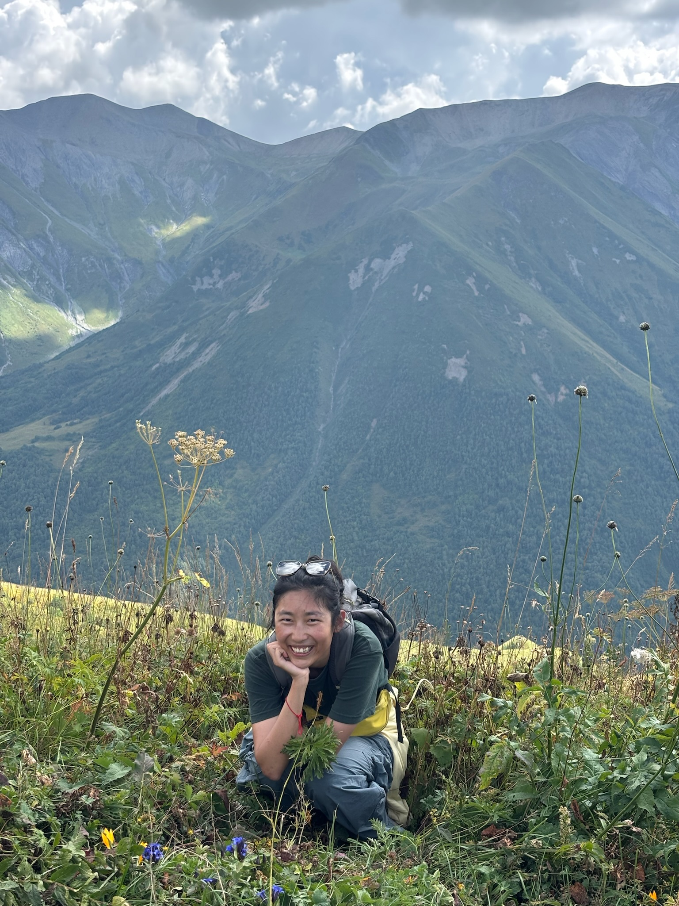

<!-- ═══════════════════════════════════════════
     ABOUT
     Edit: group name, office address, ORCID link.
     To add a photo: replace the 
…

     block with 
     ═══════════════════════════════════════════ -->
<section id="about">

About

  

    
      <svg width="16" height="16" viewBox="0 0 12 12" fill="none" stroke="currentColor" stroke-width="1">
        <circle cx="12" cy="8" r="4"/>
        <path d="M4 20c0-4 3.6-7 8-7s8 3 8 7"/>
      </svg>
      Photo
    

 

  

    <h1 class="about-name">Danqi Lang</h1>
    

      PhD Student · [Gulliver] 
      ESPCI Paris · Supervisors: Ludovic Berthier &amp; Camille Scalliet
    

    

      I am a physicist working on the glass transition, using
      molecular dynamics simulations to probe the structural and
      dynamical signatures of glassy systems. I am also broadly
      interested in how topological ideas — entanglement, knotting,
      linking — shape the behaviour of soft matter and biophysical
      systems.
    

    

      <a class="about-link" href="mailto:danqi.lang@phys.ens.fr">Email</a>
      <a class="about-link" href="https://github.com/DanqiLANG" target="_blank" rel="noopener">GitHub</a>
      <a class="about-link" href="https://scholar.google.com/citations?user=LstND5AAAAAJ&hl=zh-CN" target="_blank" rel="noopener">Google Scholar</a>
      <a class="about-link" href="#" target="_blank" rel="noopener">ORCID</a>
      <a class="about-link" href="cv.pdf" target="_blank">CV ↓</a>
    

  

</section>

<!-- ═══════════════════════════════════════════
     RESEARCH
     Status options: "Current focus" / "Internship" / "Published"
     ═══════════════════════════════════════════ -->
<section id="research">

Research

  <!-- ── Current PhD ── -->
  

    

      Glass · Simulations
      Current focus
    

    <h3>Simulational Studies of the Glass Transition</h3>
    

      PhD project at ESPCI Paris under Ludovic Berthier and Camille Scalliet.

      Dense liquids gradually solidify at low temperature via a physical process called the glass transition. While well-known and understood at the macrosopic scale, very little is known from direct experimental measurements about the dynamics of molecules in the vicinity of the glass transition. A microscopic understanding of this important process remains a lively research problem, which has resisted several decades of careful studies. In the last 10 years, non-linear dielectric measurements have been performed in molecular systems, that are interpreted as a unique way to probe emerging glassy correlations in these systems. In parallel, modern computer simulations techniques were recently developed to study the motion of molecular models at very long times, revealing the existence of a complex hierarchy of correlated molecular motion in these dense glassy fluids. While the emergence of non-trivial correlations in liquids near a glass transition is well accepted, there is no consensus and no theoretical understanding of their precise nature. Are these correlations related to an underlying phase transition accompanied by structural correlations, or instead are these correlations purely dynamic in nature, characterising the correlated motion of molecules with no relation to any static phase transition?

In this project we propose to use the newly developed numerical approaches to systematically measure non-linear response functions similar to the ones determined experimentally, while resolving in space and time the molecular dynamics that give rise to this signal. By measuring systematically static and dynamic correlations, and their relation to non-linear response functions, a microscopic interpretation of the physical content of non-linear response functions will be available. Ultimately, this work will provide the missing link between the competing theoretical approaches and the available experimental observations.
    

  

  <!-- ── MPI-PKS ── -->
  

    

      Active Matter · Soft Matter
      Internship · 2025
    

    <h3>Aging and Activity in Glassy Active Gels</h3>
    

      Active polar gels are viscoelastic media composed of orientable
      constituents continuously driven out of equilibrium by internal
      energy sources, ubiquitous in cell and tissue biology. We studied
      how molecular binding kinetics — modelled via the trap model — and
      disorder in binding energies interact with activity to fluidize or
      destabilize the glassy state. Combining analytical predictions with
      numerical simulations, we investigated whether motor activity can
      prevent aging or disrupt glassy arrest in active gels.
    

    

      MPI-PKS Dresden · Supervisors:
      <a href="https://ricardalertgroup.wixsite.com/alertgroup" target="_blank" rel="noopener">Dr. Ricard Alert</a>
      &amp;
      <a href="https://www.ryotatakaki.com/" target="_blank" rel="noopener">Dr. Ryota Takaki</a>
    

  

  <!-- ── Institut Curie ── -->
  

    

      Biophysics · Nonlinear Dynamics
      Internship · 2025
    

    <h3>Two-Tone Interference in a Nonlinear Model of the Cochlea</h3>
    

      The inner ear achieves remarkable sensitivity and frequency selectivity
      through an active amplification mechanism near a Hopf bifurcation.
      We studied basilar membrane displacement under two-tone stimulation in
      a model of critical oscillators, analysing the asymmetric behaviour in
      both two-tone suppression and two-tone distortion products.
    

    

      Institut Curie, Paris · Supervisors:
      <a href="https://institut-curie.org/person/pascal-martin" target="_blank" rel="noopener">Prof. Pascal Martin</a>
      &amp;
      <a href="https://institut-curie.org/person/carles-blanch-mercader" target="_blank" rel="noopener">Dr. Carles Blanch Mercader</a>
    

  

  <!-- ── ESPCI internship ── -->
  

    

      Glass · Simulations
      Published
    

    <h3>Excitations and Locally-Favored Structures in Glass-Forming Liquids</h3>
    

      We performed molecular dynamics simulations on Kob-Andersen mixtures
      to investigate the relaxation mechanism in supercooled liquids,
      revealing a robust anti-correlation between dynamical excitations and
      locally-favored structures. This work establishes a spatial link
      between structure and dynamics, published as an <em>Editors' Suggestion</em>.
    

    

      ESPCI Paris, Gulliver Lab · Supervisors:
      <a href="https://paddyroyall.github.io/padrus/index.html" target="_blank" rel="noopener">Prof. Paddy Royall</a>
      &amp;
      <a href="https://camillescalliet.github.io/" target="_blank" rel="noopener">Dr. Camille Scalliet</a>
      ·
      <a href="https://journals.aps.org/pre/abstract/10.1103/PhysRevE.111.055415" target="_blank" rel="noopener">PRE 111, 055415 (2025)</a>
    

  

  <!-- ── Roskilde ── -->
  

    

      Glass · Statistical Mechanics
      Published
    

    <h3>NVU Dynamics in Energy-Polydisperse Lennard-Jones Systems</h3>
    

      We performed GPU-accelerated molecular dynamics simulations to
      investigate hidden scale invariance in energy-polydisperse Lennard-Jones
      systems, using the NVU (constant potential-energy surface) formulation
      as a theoretical lens to quantify isomorph-like invariants in
      polydisperse glass formers.
    

    

      Roskilde University · Supervisors:
      <a href="https://jcdyre.dk/" target="_blank" rel="noopener">Prof. Jeppe Dyre</a>
      &amp;
      Prof. Lorenzo Costigliola
      ·
      <a href="https://journals.aps.org/pre/abstract/10.1103/PhysRevE.111.025420" target="_blank" rel="noopener">PRE 111, 025420 (2025)</a>
    

  

  <!-- ── Zhejiang / IDP ── -->
  

    

      Proteins · Topology
      Published
    

    <h3>Link Node: Topological Characterisation of Intrinsically Disordered Proteins</h3>
    

      We introduced <em>Link Node</em>, a structural motif quantified via the
      Gauss Linking Number, to characterise chain entanglement in intrinsically
      disordered proteins (IDPs). All-atom MD simulations revealed that link
      nodes are associated with slow dynamics and heterogeneous conformational
      sampling, providing a topological descriptor invisible to conventional
      structural analysis.
    

    

      Zhejiang University · Supervisor:
      <a href="https://person.zju.edu.cn/en/jingyuan" target="_blank" rel="noopener">Prof. Jing-Yuan Li</a>
      ·
      <a href="https://onlinelibrary.wiley.com/doi/full/10.1002/qub2.96" target="_blank" rel="noopener">Quantitative Biology (2025)</a>
    

  

</section>

<!-- ═══════════════════════════════════════════
     NOTES
     Edit: note titles (and their href links) and descriptions.
     ═══════════════════════════════════════════ -->
<section id="notes">

Notes

  

    <a class="note-title" href="common_sense_phy/">Common Sense in Physics</a>
    P.W. Anderson · More is Different
  

  

    <a class="note-title" href="topology_mix/">Topology 杂谈</a>
    Miscellaneous musings
  

</section>

<!-- ═══════════════════════════════════════════
     PUBLICATIONS
     Edit: fill in co-authors and check journal details.
     Copy a 
…
 block to add more papers.
     ═══════════════════════════════════════════ -->
<section id="publications">

Publications

  

    
2025

    

      
Relaxations in glass-forming systems: the anti-correlation between excitations and locally-favored structures

      
D. Lang, P. Royall, C. Scalliet

      
Physical Review E 111, 055415 (2025) — <em>Editors' Suggestion</em>

      

        <a class="pub-link" href="https://journals.aps.org/pre/abstract/10.1103/PhysRevE.111.055415" target="_blank" rel="noopener">DOI</a>
      

    

  

  

    
2025

    

      
NVU view on energy polydisperse Lennard-Jones systems

      
D. Lang, J. C. Dyre, L. Costigliola

      
Physical Review E 111, 025420 (2025)

      

        <a class="pub-link" href="https://journals.aps.org/pre/abstract/10.1103/PhysRevE.111.025420" target="_blank" rel="noopener">DOI</a>
      

    

  

  

    
2025

    

      
Link Node: a method to characterize the chain topology of intrinsically disordered proteins

      
D. Lang, L. Chen, M. Zhang, H. Song, J.-Y. Li

      
Quantitative Biology (2025)

      

        <a class="pub-link" href="https://onlinelibrary.wiley.com/doi/full/10.1002/qub2.96" target="_blank" rel="noopener">DOI</a>
      

    

  

</section>

<!-- ═══════════════════════════════════════════
     CONFERENCES & TALKS
     Edit: year, title, venue, location.
     talk-type options: "Talk" / "Poster" / "Invited"
     Copy a 
…
 block to add more entries.
     ═══════════════════════════════════════════ -->
<section id="talks">

Conferences &amp; Talks

  

    
2025

    

      
[Title of your talk or poster]

      
[Conference name]

      
[City, Country]

      Talk
    

  

  

    
2024

    

      
[Title of your talk or poster]

      
[Conference name]

      
[City, Country]

      Poster
    

  

</section>

<!-- ═══════════════════════════════════════════
     CONTACT
     Edit: ORCID number and office address.
     ═══════════════════════════════════════════ -->
<section id="contact">

Contact

  

    
Email

    

      <a href="mailto:danqi.lang@espci.fr">danqi.lang @espci.fr</a>
    

  

  

    
GitHub

    

      <a href="https://github.com/DanqiLANG" target="_blank" rel="noopener">DanqiLANG</a>
    

  

  

    
Google Scholar

    

      <a href="https://scholar.google.com/citations?user=LstND5AAAAAJ&hl=zh-CN" target="_blank" rel="noopener">Profile ↗</a>
    

  

  

    
ORCID

    

      <a href="#" target="_blank" rel="noopener">0000-0000-0000-0000</a>
    

  

  

    
CV

    

      <a href="cv.pdf" target="_blank">Download PDF ↓</a>
    

  

  

    
Address

    

      10 rue Vauquelin, 
      75005 Paris, 
      France
    

  

</section>

